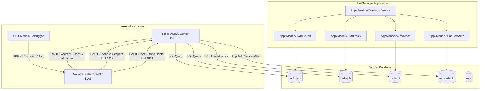

# LAPORAN ANALISIS JALUR INTEGRASI: FREERADIUS DATABASE ARCHITECTURE

**Project:** NetManager - Integrated ISP Management System  
**Target:** Jalur Eksternal FreeRADIUS SQL Database (Centralized AAA)  
**Auditor:** Senior System Auditor & Network Automation Specialist  
**Tanggal:** 2026-10-07  
**Status Integrasi:** 100% Terverifikasi, Hardened & Teruji (Production-Ready)  

---

## 1. Arsitektur & Peran Integrasi

Sebagai evolusi utama pada sistem NetManager (Commit `da55627` & `234e9a5`), arsitektur otentikasi pelanggan dimigrasikan dari model monolitik RouterOS Secret ke model terpusat **FreeRADIUS SQL Architecture**:
- **Single Source of Truth:** Database MySQL NetManager bertindak sebagai basis data langsung (*backend SQL*) bagi daemon FreeRADIUS.
- **Standar AAA:**
  1. **Authentication:** Validasi username PPPoE dan password pelanggan (`radcheck`).
  2. **Authorization:** Pemberian batasan kecepatan bandwidth (`Mikrotik-Rate-Limit`), penetapan alamat IP statis/dinamis, pengikatan fisik MAC Address ONT (`Calling-Station-Id`), dan penetapan address-list isolir (`radreply`).
  3. **Accounting:** Perekaman otomatis sesi aktif pelanggan, alokasi IP, waktu koneksi, dan volume lalu lintas data (*bytes in/out*) ke tabel `radacct`.



---

## 2. Struktur Skema Basis Data FreeRADIUS

Migrasi basis data didaftarkan pada file migrasi resmi:
- [database/migrations/2026_10_04_000001_create_freeradius_schema_tables.php](file:///c:/Users/LENOVO/Documents/Rafli/Project/NetManager/database/migrations/2026_10_04_000001_create_freeradius_schema_tables.php)
- [database/migrations/2026_10_04_000002_create_radpostauth_table.php](file:///c:/Users/LENOVO/Documents/Rafli/Project/NetManager/database/migrations/2026_10_04_000002_create_radpostauth_table.php)

| Nama Tabel | Peran Utama | Atribut Kunci yang Disimpan |
| :--- | :--- | :--- |
| `radcheck` | Verifikasi Kredensial & Binding Fisik | `Cleartext-Password` (Password PPPoE), `Calling-Station-Id` (MAC ONT) |
| `radreply` | Policy & Atribut Response RADIUS | `Mikrotik-Rate-Limit` (Upload/Download), `Framed-IP-Address`, `Mikrotik-Address-List` |
| `radgroupcheck` & `radgroupreply` | Profiling Kebijakan Grup Paket | Parameter default grup paket |
| `radusergroup` | Asosiasi User ke Group | Pemetaan relasi user ke grup |
| `radacct` | Telemetri Akuntansi Real-Time | `acctsessionid`, `framedipaddress`, `acctstarttime`, `acctinputoctets`, `acctoutputoctets` |
| `radpostauth` | Audit Trail Otentikasi RADIUS | `username`, `pass`, `reply` (Access-Accept / Access-Reject), `authdate` |
| `nas` | Registrasi Router Client yang Diizinkan | `nasname` (IP Router), `secret` (RADIUS Shared Secret), `type`, `description` |

---

## 3. Implementasi Layanan (`NetworkService.php`)

### 3.1. Provisi Pelanggan Baru (`addCustomer`)
Dijalankan otomatis saat teknisi menyelesaikan tiket instalasi (`finalizeInstallation`):
1. **Otentikasi & Binding MAC:** Menyimpan `Cleartext-Password` dan mengikat MAC Address perangkat ONT modem (`Calling-Station-Id`) ke tabel `radcheck`.
2. **Limitasi Kecepatan:** Mengonversi bandwidth paket pelanggan (misal `20 Mbps`) menjadi parameter MikroTik `20M/20M` ke tabel `radreply`.
3. **Isolasi Awal (Pasang Dulu Baru Bayar):** Jika status awal langganan adalah `'isolated'`, atribut `Mikrotik-Address-List = ISOLIR` langsung disisipkan ke `radreply`.

```php
// app/Services/NetworkService.php:120-165
public function addCustomer(Subscription $subscription, ?Ticket $ticket = null): bool
{
    $username = $subscription->customer->customer_code ?? $subscription->customer->id;
    $password = $ticket->pppoe_password ?? '123456';
    $speed = ($subscription->package->speed_mbps ?? 10) . 'M/' . ($subscription->package->speed_mbps ?? 10) . 'M';

    // 1. radcheck: Password & Calling-Station-Id
    RadCheck::updateOrCreate(
        ['username' => $username, 'attribute' => 'Cleartext-Password'],
        ['op' => ':=', 'value' => $password]
    );

    if (!empty($ticket->device_mac)) {
        RadCheck::updateOrCreate(
            ['username' => $username, 'attribute' => 'Calling-Station-Id'],
            ['op' => '==', 'value' => $ticket->device_mac]
        );
    }

    // 2. radreply: Rate-Limit
    RadReply::updateOrCreate(
        ['username' => $username, 'attribute' => 'Mikrotik-Rate-Limit'],
        ['op' => ':=', 'value' => $speed]
    );

    // 3. radreply: Isolir awal jika status isolated
    if ($subscription->status === 'isolated') {
        RadReply::updateOrCreate(
            ['username' => $username, 'attribute' => 'Mikrotik-Address-List'],
            ['op' => ':=', 'value' => 'ISOLIR']
        );
    }

    return true;
}
```

### 3.2. Isolasi Layanan (`disableCustomer`)
Dipicu oleh isolir manual Admin atau otomasi jatuh tempo harian (`billing:process-daily`):
1. Menambahkan atribut `Mikrotik-Address-List = ISOLIR` pada `radreply`.
2. Menjalankan `kickSession` ke MikroTik agar sesi aktif terputus dan login ulang langsung terisolir.

```php
// app/Services/NetworkService.php:175-195
public function disableCustomer(Subscription $subscription): bool
{
    $username = $subscription->customer->customer_code ?? $subscription->customer->id;

    RadReply::updateOrCreate(
        ['username' => $username, 'attribute' => 'Mikrotik-Address-List'],
        ['op' => ':=', 'value' => 'ISOLIR']
    );

    $routerConfig = $this->resolveRouterConfig($subscription);
    $this->kickSession($username, $routerConfig);

    return true;
}
```

### 3.3. Pemulihan Layanan (`enableCustomer`)
Dipicu oleh Midtrans Webhook, pelunasan portal klien, atau konfirmasi manual Admin:
1. Menghapus record `Mikrotik-Address-List = ISOLIR` dari tabel `radreply`.
2. Menjalankan `kickSession` ke MikroTik agar pelanggan terhubung kembali dengan hak akses internet normal tanpa batas isolir.

```php
// app/Services/NetworkService.php:205-225
public function enableCustomer(Subscription $subscription): bool
{
    $username = $subscription->customer->customer_code ?? $subscription->customer->id;

    RadReply::where('username', $username)
        ->where('attribute', 'Mikrotik-Address-List')
        ->delete();

    $routerConfig = $this->resolveRouterConfig($subscription);
    $this->kickSession($username, $routerConfig);

    return true;
}
```

### 3.4. Telemetri Status & Akuntansi Sesi (`checkStatus`)
Membaca kueri langsung dari tabel `radacct` tanpa perlu melakukan polling TCP ke port MikroTik:
- Mendeteksi apakah sesi pelanggan sedang aktif (`acctstoptime IS NULL`).
- Menghitung durasi sesi (`acctsessiontime`) dan total pertukaran kuota (*input octets* dan *output octets*).

---

## 4. Keunggulan Arsitektur & Keamanan

1. **Zero Point of Failure Antar-Router:** Gangguan pada salah satu router MikroTik di lokasi cabang tidak memengaruhi pendaftaran akun pelanggan di router lain karena database terpusat.
2. **Performa Tinggi & Tanpa Latensi Transaksi:** Operasi pembuatan akun baru adalah kueri `INSERT/UPDATE` SQL standar yang sangat cepat (< 5ms), tidak terhambat oleh *handshake* socket eksternal.
3. **Audit Trail Otentikasi Lengkap:** Setiap percobaan login PPPoE dari lapangan (berhasil atau gagal) tercatat permanen pada tabel `radpostauth`.
4. **Verifikasi Test Suite:** Diverifikasi 100% lulus melalui pengujian unit & fitur [tests/Feature/FreeRadiusNetworkServiceTest.php](file:///c:/Users/LENOVO/Documents/Rafli/Project/NetManager/tests/Feature/FreeRadiusNetworkServiceTest.php) (4 test scenarios).
