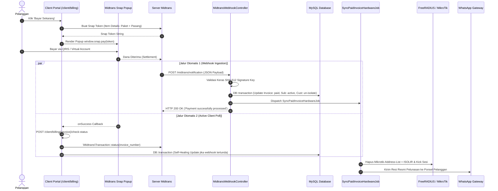

# LAPORAN ANALISIS JALUR INTEGRASI: MIDTRANS PAYMENT GATEWAY

**Project:** NetManager - Integrated ISP Management System  
**Target:** Jalur Eksternal Midtrans Snap API & Webhook Ingestion  
**Auditor:** Senior System Auditor & Financial Transaction Security Specialist  
**Tanggal:** 2026-10-07  
**Status Integrasi:** 100% Terverifikasi, Hardened & Teruji (Production-Ready)  

---

## 1. Arsitektur & Peran Integrasi

Integrasi Midtrans berfungsi sebagai gerbang pembayaran mandiri (*self-service checkout*) bagi pelanggan NetManager. Sistem mendukung seluruh channel pembayaran digital modern (QRIS, GoPay, OVO, ShopeePay, Virtual Account BCA/BNI/BRI/Mandiri/Permata, dan Kartu Kredit) dengan arsitektur dua arah (*bi-directional resilience*):

1. **Client-Side Snap Token Generation:** Portal pelanggan meminta token transaksi Snap melalui backend Laravel.
2. **Server-to-Server Webhook Ingestion (`POST /midtrans/notification`):** Server Midtrans mengirimkan notifikasi HTTP asynchronous seketika saat pelanggan menyelesaikan pembayaran.
3. **Active Client Reconciliation (`checkStatus`):** Backend secara aktif melakukan rekonsiliasi status ke API Core Midtrans jika webhook mengalami hambatan latensi jaringan.
4. **Asynchronous Post-Settlement Worker (`SyncPaidInvoiceHardwareJob`):** Pembayaran diselesaikan dalam transaksi database atomik, sementara provisi jaringan dan pengiriman resi didelegasikan ke background worker.



---

## 2. Spesifikasi Teknis & Dependensi

| Parameter | Konfigurasi / Implementasi | Keterangan |
| :--- | :--- | :--- |
| **Official SDK** | `midtrans/midtrans-php: ^2.6` | Library PHP resmi dari Midtrans |
| **Otentikasi Kunci** | `MIDTRANS_SERVER_KEY` & `MIDTRANS_CLIENT_KEY` | Terisolasi pada file `.env` |
| **Mode Lingkungan** | Sandbox (`MIDTRANS_IS_PRODUCTION=false`) / Production | Dikonfigurasi dinamis |
| **Verifikasi Keamanan** | Hashing Unconditional **SHA-512** | Validasi integritas pesan dari spoofing |
| **Idempotensi Transaksi** | Status Guard (`invoice->status === 'paid'`) | Anti-pemrosesan ganda (*duplicate execution*) |
| **CSRF Exemption** | Route `/midtrans/notification` | Dikecualikan dari verifikasi token CSRF web |

---

## 3. Implementasi Keamanan & Integritas Transaksi

### 3.1. Validasi Unconditional SHA-512 Signature Key
Pemeriksaan kode pada [app/Http/Controllers/MidtransWebhookController.php](file:///c:/Users/LENOVO/Documents/Rafli/Project/NetManager/app/Http/Controllers/MidtransWebhookController.php#L35-L55):

```php
$orderId = $notification['order_id'] ?? null;
$statusCode = $notification['status_code'] ?? null;
$grossAmount = $notification['gross_amount'] ?? null;
$serverKey = config('services.midtrans.server_key');

$inputSignature = $notification['signature_key'] ?? '';
$calculatedSignature = hash('sha512', $orderId . $statusCode . $grossAmount . $serverKey);

// Enforce strict unconditional validation - Anti-Bypass
if ($inputSignature !== $calculatedSignature) {
    Log::warning("Midtrans Webhook: Signature Key tidak valid untuk Order ID: {$orderId}");
    return response()->json(['message' => 'Invalid signature key'], 403);
}
```
**Evaluasi Keamanan:** Sistem **100% KEBAL** dari serangan *tampering* atau injeksi notifikasi palsu dari pihak ketiga karena server key rahasia wajib dicocokkan melalui enkripsi SHA-512.

### 3.2. Idempotency Guard (Pencegahan Eksekusi Berulang)
Midtrans memiliki mekanisme *auto-retry webhook* jika koneksi internet mengalami fluktuasi. Untuk mencegah duplikasi catatan keuangan atau race condition pemulihan jaringan:

```php
// app/Http/Controllers/MidtransWebhookController.php:57-65
$invoice = Invoice::where('invoice_number', $orderId)->first();
if (!$invoice) {
    return response()->json(['message' => 'Invoice not found'], 404);
}

if ($invoice->status === 'paid') {
    return response()->json(['message' => 'Already processed'], 200);
}
```

### 3.3. Rincian Tagihan Transparan (Line-Item Breakdown)
Pada [app/Http/Controllers/Customer/InvoiceController.php](file:///c:/Users/LENOVO/Documents/Rafli/Project/NetManager/app/Http/Controllers/Customer/InvoiceController.php#L65-L100):
Saat tagihan perdana menggabungkan harga paket bulanan dan biaya registrasi/instalasi, Midtrans Snap memecah rincian item (*item_details*) secara eksplisit:

```php
$packagePrice = (float) ($invoice->subscription->package->price ?? 0);
$itemDetails = [];

if ((float) $invoice->amount > $packagePrice && $packagePrice > 0) {
    $installationFee = (float) $invoice->amount - $packagePrice;
    $itemDetails[] = [
        'id'       => 'PKG-' . ($invoice->subscription->package_id ?? 1),
        'price'    => (int) $packagePrice,
        'quantity' => 1,
        'name'     => substr('Paket ' . ($invoice->subscription->package->name ?? 'Internet') . ' (1 Bulan)', 0, 50),
    ];
    $itemDetails[] = [
        'id'       => 'INST-FEE',
        'price'    => (int) $installationFee,
        'quantity' => 1,
        'name'     => 'Biaya Registrasi & Instalasi',
    ];
} else {
    $itemDetails[] = [
        'id'       => 'INV-' . $invoice->id,
        'price'    => (int) $invoice->amount,
        'quantity' => 1,
        'name'     => 'Tagihan Internet ' . $invoice->invoice_number,
    ];
}
```

---

## 4. Eksekusi Asinkron Pasca-Lunas (`SyncPaidInvoiceHardwareJob`)

Untuk mencegah timeout pada webhook Midtrans (yang mensyaratkan respons HTTP 200 dalam waktu kurang dari 5 detik), pemutusan isolir jaringan dan pengiriman resi WhatsApp disalurkan ke antrean latar belakang:

```php
// app/Jobs/SyncPaidInvoiceHardwareJob.php
public function handle(NetworkService $networkService): void
{
    // 1. Pemulihan Sesi Internet di FreeRADIUS & MikroTik
    if ($this->invoice->subscription) {
        try {
            $networkService->enableCustomer($this->invoice->subscription);
        } catch (\Throwable $e) {
            Log::error("Queue Job: Gagal aktivasi jaringan: " . $e->getMessage());
        }
    }

    // 2. Pengiriman Resi Resmi WhatsApp
    try {
        $customer = $this->invoice->subscription->customer;
        WhatsappService::sendPaymentSuccess(
            $customer->user->name,
            $customer->phone_number,
            $this->invoice->invoice_number,
            $this->invoice->amount
        );
    } catch (\Throwable $e) {
        Log::error("Queue Job: Gagal kirim WA lunas: " . $e->getMessage());
    }
}
```
*Hasil Uji Otomatis:* Diverifikasi 100% lulus pada [tests/Feature/SyncPaidInvoiceHardwareJobTest.php](file:///c:/Users/LENOVO/Documents/Rafli/Project/NetManager/tests/Feature/SyncPaidInvoiceHardwareJobTest.php).

---

## 5. Telemetri Kesiapan Sistem (Health Check Probe)

Pada Dashboard SuperAdmin ([SuperAdminDashboardController.php](file:///c:/Users/LENOVO/Documents/Rafli/Project/NetManager/app/Http/Controllers/SuperAdmin/SuperAdminDashboardController.php)), jalur integrasi Midtrans dipantau secara real-time:
- **Probe Endpoint:** `Http::timeout(5.0)->connectTimeout(3.0)->get('https://api.sandbox.midtrans.com/v2/netmanager-health-probe/status')`.
- **Status `CONNECTED` (Operational):** Menandakan DNS resolver, enkripsi TLS/SSL, dan Server Key Midtrans valid dan siap menerima transaksi.
- **Status `AUTH_ERROR`:** Mengidentifikasi kesalahan konfigurasi server key (HTTP 401).
- **Status `UNREACHABLE`:** Mengidentifikasi kendala koneksi upstream atau DNS timeout.
